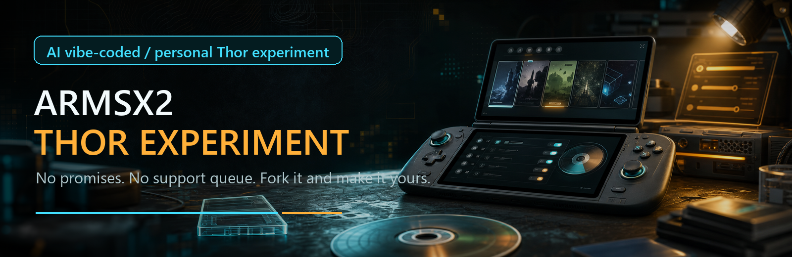
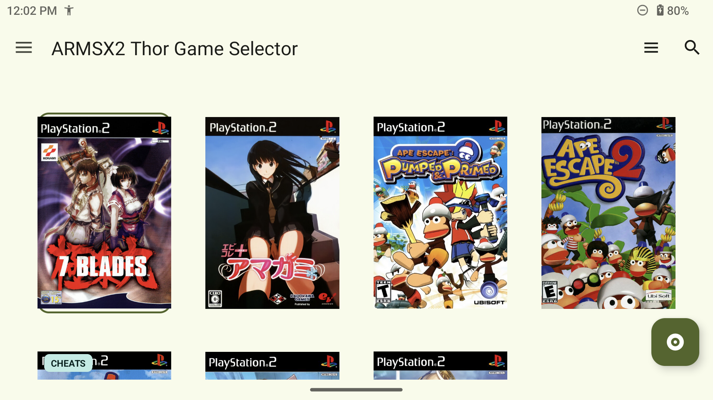
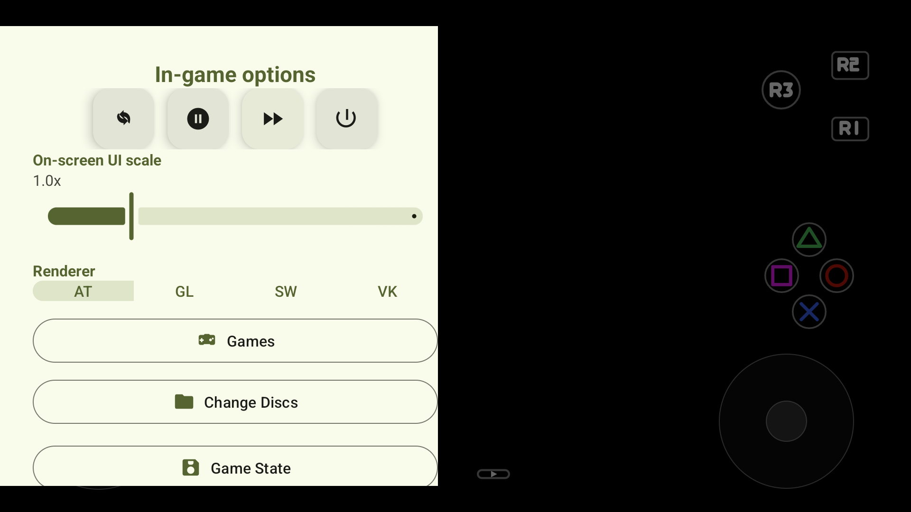

<div align="center">



# ARMSX2 Thor Experiment

Personal, unsupported AYN Thor experiment fork of ARMSX2.


</div>

This is a fork I am using to make ARMSX2 feel better on the AYN Thor. It is vibe-coded with AI, changed quickly, and intentionally opinionated. No stability guarantee, no support promise, no polish promise.

If that bothers you, look elsewhere. Fork it, break it, fix it, make it yours.

Please do not open issues expecting support or a roadmap. This is not a product queue. It is a personal experiment that happens to be public.

Bring your own legally dumped PS2 BIOS and games. Use this only for personal experimentation.

## Screenshots

Screenshots are from a personal AYN Thor test device.

| Game selector | In-game OSD |
| --- | --- |
|  |  |

## Where This Fork Diverges

- AYN Thor is the target device for layout, workflow, and sanity checks.
- The game selector favors cover-first browsing and hardcoded xlenore PS2 cover defaults.
- Cover cards show `CHEATS` only when real `.pnach` files exist in the selected ARMSX2 data root `cheats` folder.
- Bundled real cheat PNACHs from the NetherSX2 patch collection are included under `app/src/main/assets/cheats` and copied only when missing.
- Cheat controls are split by PNACH section so each cheat section can be toggled on its own.
- Widescreen and 60 FPS patch metadata are intentionally not used for cheat badges or cheat switches.
- The in-game drawer has Thor-friendly shortcuts for renderer changes, fast forward, game state, disc changes, imports, and cheat toggles.
- The React Native experiment remains present, but the native Android Java/XML UI is the active path.

## What This Is Not

- Not official ARMSX2.
- Not PCSX2.
- Not a general support fork.
- Not a compatibility promise.
- Not a place to request features.

## Build From Source

From the repo root on Windows:

```powershell
.\gradlew.bat :app:assembleUnrestrictedDebug
```

For a quicker Java/XML check:

```powershell
.\gradlew.bat :app:compileDebugJavaWithJavac
```

## Credits

This fork stands on the work of:

- [ARMSX2](https://github.com/ARMSX2/ARMSX2)
- [PCSX2](https://github.com/PCSX2/pcsx2)
- [PCSX2_ARM64](https://github.com/pontos2024/PCSX2_ARM64)
- [xlenore/ps2-covers](https://github.com/xlenore/ps2-covers)
- [NetherSX2-patch](https://github.com/noeldvictor/NetherSX2-patch)

Licensed under GPLv3. See [COPYING.GPLv3](COPYING.GPLv3).
